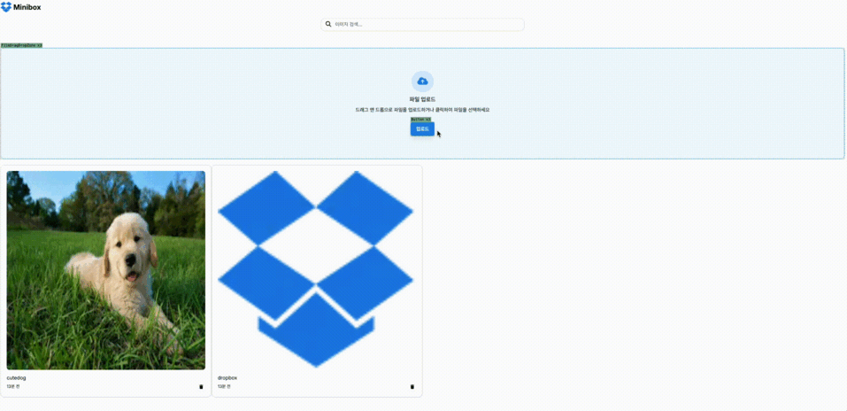

# Dropbox

Next.js, React Query, Supabase를 활용한 Dropbox WebApp입니다.

## 주요 기능

### 🎯 핵심 기능

- **드래그 앤 드롭**: 간편한 파일 업로드 지원
- **파일 관리**:
  - 이미지 파일 업로드
  - 파일 목록 조회
  - 파일명 표시 (한글 지원)
  - 파일 삭제
- **시간 추적**: 파일별 업로드 시간 표시 (상대적 시간)

### 🛠 기술 구현

#### 아키텍처

- **모노레포 구조**:
  - 공유 UI 컴포넌트 (`@next-inflearn/ui`)
  - 공유 Supabase 클라이언트 (`@next-inflearn/supabase`)
  - Dropbox 애플리케이션 (`apps/dropbox`)

#### 프론트엔드

- **React Query 통합**:
  - 효율적인 파일 목록 관리
  - 낙관적 업데이트로 즉각적인 UI 반응
  - 자동 데이터 동기화
- **React Dropzone**:
  - 직관적인 파일 업로드 인터페이스
  - 드래그 앤 드롭 지원
  - 파일 유효성 검사
- **Material Tailwind**:
  - 모던한 UI 컴포넌트
  - 반응형 그리드 레이아웃
  - 일관된 디자인 시스템

#### 백엔드

- **Supabase 통합**:
  - 안전한 파일 스토리지
  - 타입 안전한 스토리지 작업
  - 효율적인 파일 관리
- **파일 처리**:
  - 한글 파일명 자동 변환
  - 안전한 파일명 인코딩/디코딩
  - 이미지 최적화

## 기술 스택

- **프레임워크**: Next.js 14 (App Router)
- **언어**: TypeScript
- **스타일링**: Tailwind CSS + Material Tailwind + (ShadCn)
- **상태 관리**: React Query
- **스토리지**: Supabase Storage
- **파일 업로드**: React Dropzone
- **패키지 매니저**: pnpm
- **모노레포 도구**: Turborepo
